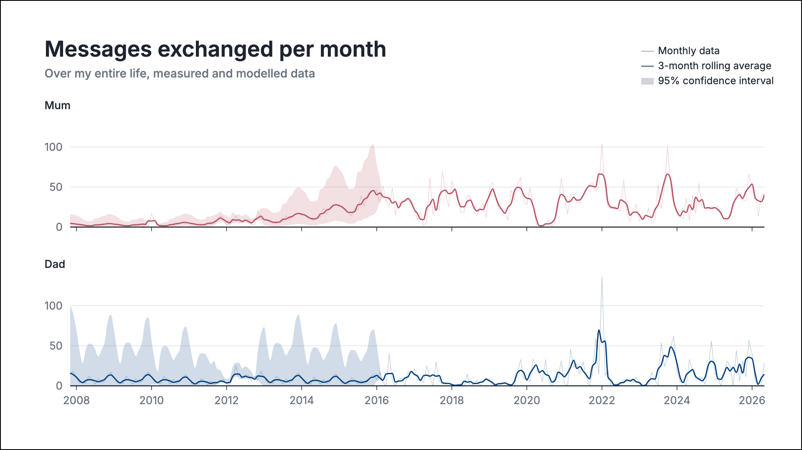
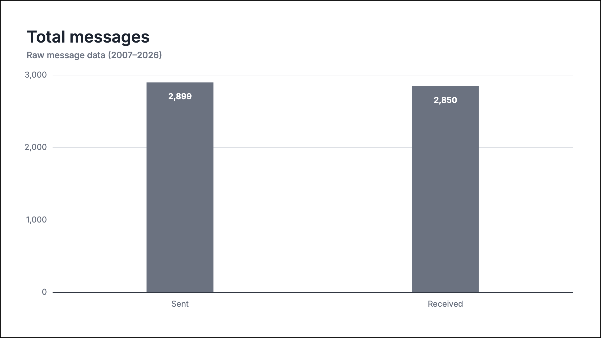
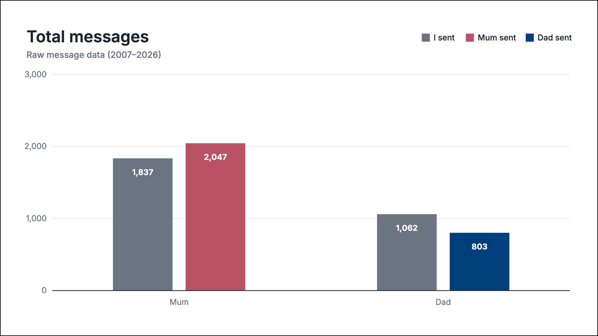
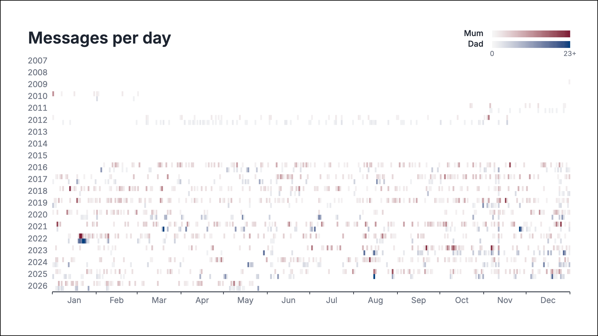
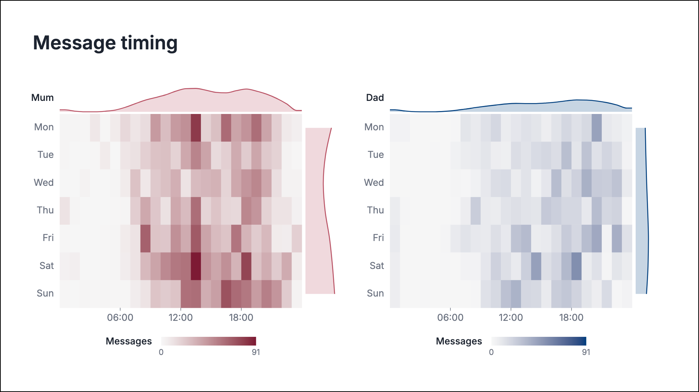
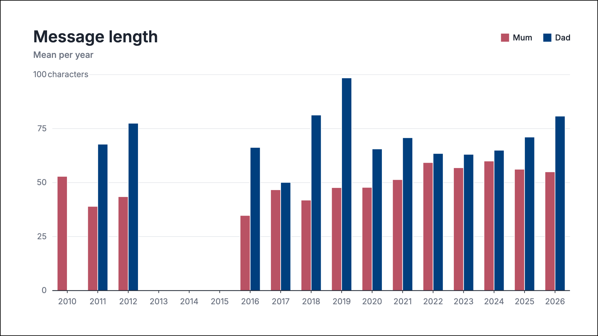
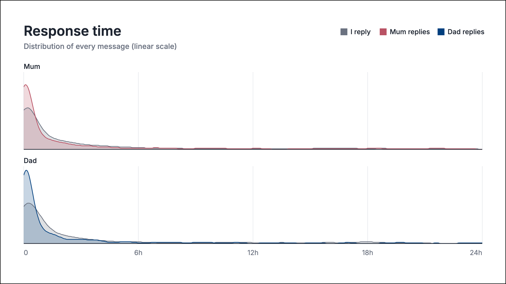
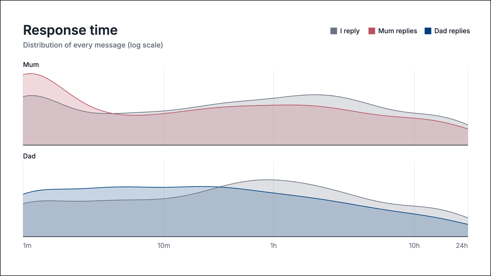
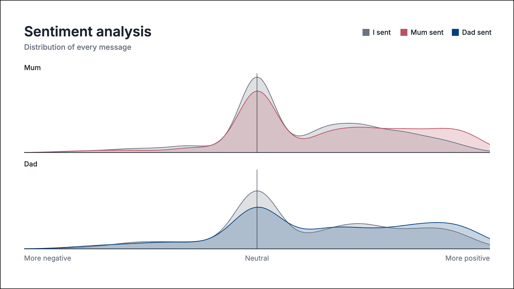
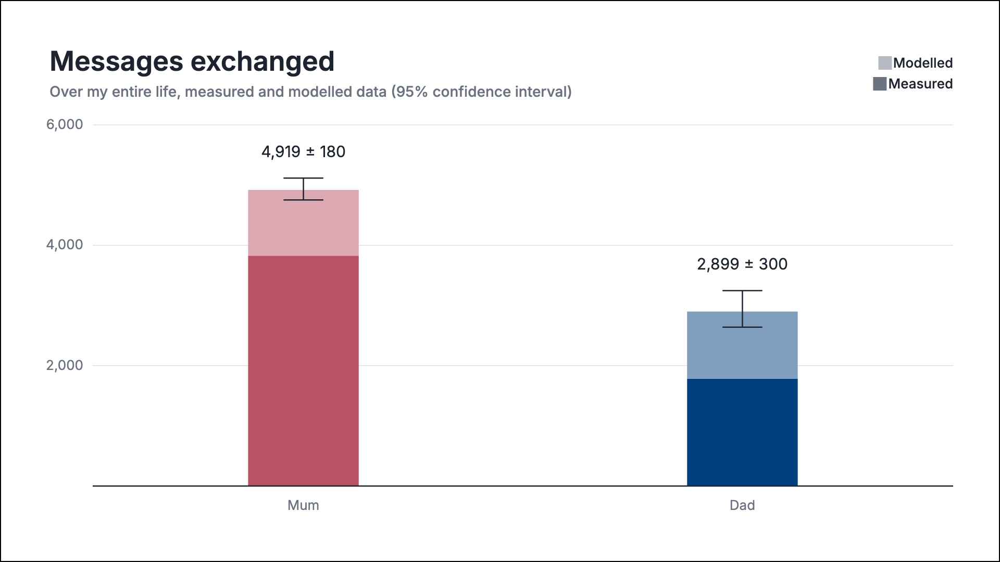

# 20 Years of Messages With My Parents

Code from [this video](https://youtu.be/0Va2q4xqDME) — shared by request.

Rebuilds complete text history (in my case, with my mum and dad) from WhatsApp exports, the iMessage database, and for old phones with no easy export route, photos of the messages on the phone's screen (I *thought* this was more efficient than manually transcribing the messages). Then it models the periods where there is no data, and creates some nice charts.

My messages aren't in this repo, and yours won't leave your machine if you use this code. Everything the pipeline reads or writes lives in `data/`. The included charts are examples from my conversations with my parents, as seen in the video.

Note: this workflow is specific to my circumstances. You'll likely need to modify and adapt things to fit to your own data if attempting to repeat this.

<p align="center"></p>

## Usage

```bash
pip install -r requirements.txt
```

Everything that's specific to you (who you're messaging, where the exports are, which periods are missing) is set in `config.py`. Then run the scripts in number order; each reads the previous's output from `data/` and prints a summary so you can check as you go.

| Script | What it does |
|---|---|
| `1a_extract_imessage.py` | iMessage + SMS from macOS's `chat.db`. Run with `--list-chats` first to find your chat IDs. |
| `1b_extract_whatsapp.py` | WhatsApp's exported chat `.txt` files (Export Chat → Without Media). |
| `1c_extract_sms_photos.py` | Uses OCR on photos of an old phone's screen with Apple Vision — for phones with no export path at all. |
| `2_combine_messages.py` | Merges everything into one tidy log. |
| `3_model_missing_sent.py` | Imputes sent counts for months where only the inbox survived. |
| `4_model_missing_months.py` | Fills the months with no data at all. |
| `5_prepare_timeseries.py` | Collapses the Monte Carlo samples into plot-ready tables + lifetime totals. |
| `6_score_sentiment.py` | Scores every message's tone with VADER. |
| `7_prepare_chart_data.py` | Rebuilds `charts_d3/chart_data.js` from your data, so the charts show your messages. |

The extraction scripts (`1a`, `1c`) are macOS-only (I only had access to a mac when I was working on this); everything from script 2 onwards runs anywhere. If your data has no gaps, scripts 3–5 just pass the observed data through.

## The charts

| | |
|---|---|
|  |  |
|  |  |
|  |  |
|  |  |
|  |  |

These are the actual d3.js charts from the video, in `charts_d3/`. I used d3 because they were designed as 1080p frames for the video; d3 gives full control over the layout, and each chart is just an HTML file you can open in a browser (no server needed). They read their numbers from `chart_data.js`, which `7_prepare_chart_data.py` rebuilds from the pipeline outputs, so after running the pipeline the whole set shows *your* messages. The PNGs above are renders from my data.

---

## Notes

### Missing data

The missing data in my circumstances appeared in two ways. Old phones only held a handful of messages; one kept its inbox but lost its sent folder; one iPhone was factory-reset, erasing three years. So there are two models: script 3 handles months where received messages survive but sent don't, and script 4 handles months with nothing at all.

### Half-observed months

The received half of a month is a strong anchor for the missing half. The one important choice is that the ratio comes from complete months *inside the missing era*, not from modern data — texting habits change. Since only three complete months per parent survive from that era, the ratio itself is uncertain, and a Beta posterior over it plus Negative Binomial count noise carries that uncertainty into the results.

### Empty months

With nothing in-month to anchor on, script 4 leans on the two things texting reliably has: yearly seasonality (Christmas spikes, term-time dips) and a slowly wandering overall level, both learnt from the complete era. Gaps with data on both sides are bridged, with uncertainty that peaks mid-gap. The gap running off the start of the record (2007–2009) is one-sided extrapolation into a life stage the data has never seen — the bands there are large because of this.

Empty months after the record becomes complete (2016 for me) are believed as genuine no-contact and set to zero, not modelled.

### Validation

I validated the gap model by hiding blocks of real data and asking it to recover them: the intervals covered the truth at about the advertised rate, but point estimates in anchorless months are weak. It also can't recover one-off events: if there'd been an *Incident* inside a gap, no amount of seasonality would find it.

### Sentiment

VADER is transparent and fast, and its blind spots are known: sarcasm and in-jokes are invisible, "xx" sign-offs carry no weight, and logistics texts score neutral.

## Not included

- **The raw data.** That stays between me, my parents and Mark Zuckerberg (probably).
- **The phone-evolution charts** — they run on a scraped market dataset that isn't mine to redistribute.
- **The closing "time with parents" chart** — built from US time-use survey microdata in a separate pipeline.
